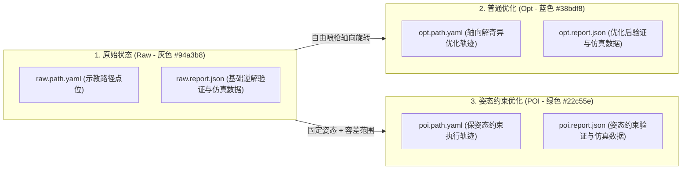
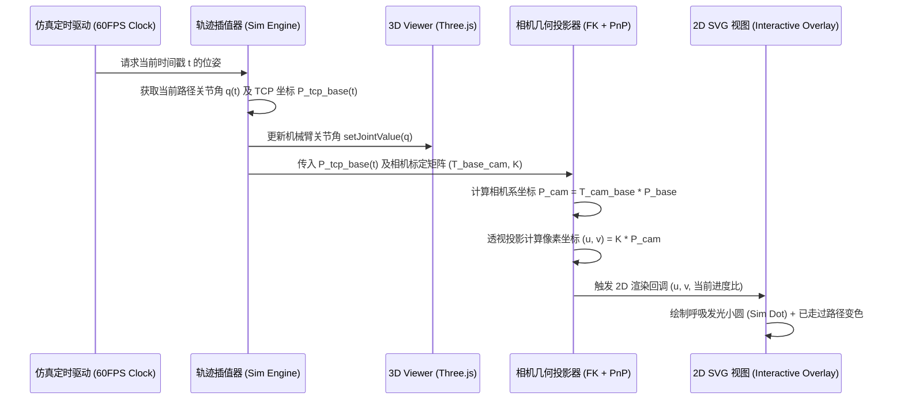

# 交互操作界面优化方案（核心功能篇：需求 5～7）

本文档针对 `app/docs/interactive_refine.md` 中的需求 5 至需求 7 进行核心算法、数据架构、文件体系、状态流转以及 3D/2D 同步仿真引擎的完整方案规划。

---

## 目录
1. [系统总体架构与三大状态模型](#1-系统总体架构与三大状态模型)
2. [功能五：文件命名体系重构与三维诊断对比视图](#2-功能五文件命名体系重构与三维诊断对比视图)
3. [功能六：POI 姿态约束优化引擎与全链路联动](#3-功能六poi-姿态约束优化引擎与全链路联动)
4. [功能七：3D/2D 跨空间实时联动仿真系统](#4-功能七3d2d-跨空间实时联动仿真系统)
5. [文件列表语义化图标设计](#5-文件列表语义化图标设计)
6. [技术风险与边界处理机制](#6-技术风险与边界处理机制)
7. [分阶段落地执行路线](#7-分阶段落地执行路线)

---

## 1. 系统总体架构与三大状态模型

系统将工件喷涂路径规范为 3 种独立且严格对应的生命周期状态：

### 三大状态特征对比表

| 状态类型 | 英文简称 | 主题色 | 核心算法与约束目标 | 机器人执行文件 | 诊断与仿真报告 |
| :--- | :--- | :--- | :--- | :--- | :--- |
| **原始状态** | **RAW** | 灰色 (`#94a3b8`) | 用户直接点击采样的 6D TCP 点（曲面法向平滑） | `raw.path.yaml` | `raw.report.json` |
| **普通优化** | **OPT** | 蓝色 (`#38bdf8`) | 允许喷枪沿喷涂轴向 $[-180^\circ, 180^\circ]$ 自由旋转以规避关节超速与奇异点 | `opt.path.yaml` | `opt.report.json` |
| **姿态约束** | **POI** | 绿色 (`#22c55e`) | 强制喷枪姿态锚定基准姿态（如 Home 点），仅允许设定容差 $(\Delta Rx, \Delta Ry, \Delta Rz)$ 浮动 | `poi.path.yaml` | `poi.report.json` |

---

## 2. 功能五：文件命名体系重构与三维诊断对比视图

### 2.1 文件分类与职责（仅 YAML 与 JSON 两种）
系统彻底简化文件类型，仅保留两大类核心文件：
1. **YAML 路径轨迹文件（`*.path.yaml`）**：
   * 专用于存储点位位姿坐标，**同时发给真实机械臂与 3D 机械臂仿真引擎执行**。
   * **`raw.path.yaml`**（或 `scan.manual.raw.paths.yaml`）：人工标定或采集生成的原始路径点。
   * **`opt.path.yaml`**（或 `scan.manual.opt.paths.yaml`）：无姿态约束普通优化后的平滑路径。
   * **`poi.path.yaml`**（或 `scan.manual.poi.paths.yaml`）：姿态约束优化（POI）后的一致性喷涂路径。
2. **JSON 诊断分析文件（`*.report.json`）**：
   * 专用于前端诊断对比、三维数据检验与详细分析报告（包含关节速度分布、超速报警与奇异点预警）。
   * **`raw.report.json`**：原始状态逆解与奇异点分析报告。
   * **`opt.report.json`**：普通优化状态分析报告。
   * **`poi.report.json`**：POI 姿态约束优化分析报告。

### 2.2 三组状态并排诊断对比视图
在“TCP 诊断与优化”页面中，将原先的双状态对比升级为 **Raw / Opt / POI 三维并排/叠加对比矩阵**：
1. **全局指标对比卡片**：
   * 整体通过状态（PASS / WARNING / ERROR）。
   * 各关节最大角速度对比（J1~J6 峰值柱状图）。
   * 奇异点风险与连续性评分。
2. **路点明细对比表格（Waypoint Inspector）**：
   * 每一路点展示 3 组数据：`[Raw] -> [Opt] -> [POI]` 的位姿坐标 $(X, Y, Z, Rx, Ry, Rz)$ 及所计算出的 6 轴逆解关节角。
   * 差值高亮：当 POI 或 Opt 对角度做出调整时，使用对应状态色标出微调幅度。

---

## 3. 功能六：POI 姿态约束优化引擎与全链路联动

### 3.1 POI 约束核心数学模型与算法
工业喷涂中，喷枪相对工件表面的倾角需要保持稳定以确保漆膜厚度均匀。POI（Pose of Interest）即固定姿态约束优化：

1. **基准固定姿态确定（Anchor Pose）**：
   * **方式 A（自动/默认）**：默认一键从机器人 Home 姿态或当前机械臂实时 TCP 姿态中自动提取基准旋转姿态 $R_{\text{ref}}$。
   * **方式 B（人工指定）**：允许用户在界面 POI 设置弹窗中手动输入指定的基准姿态角度（$Rx, Ry, Rz$），以满足特殊工件特定喷涂仰角要求。
2. **各轴容差窗口设置（Tolerance Envelope）**：
   * $\Delta Rx$（默认 $\pm 3.0^\circ$）：小范围微调。
   * $\Delta Ry$（默认 $\pm 15.0^\circ$）：允许一定前后俯仰。
   * $\Delta Rz$（默认 $\pm 180.0^\circ$）：喷枪绕自身喷涂轴向自由旋转。
3. **约束优化求解流程**：
   * 在对轨迹进行稠密插值求解逆运动学时，候选姿态 $R_{\text{cand}}$ 必须满足：
     $$\text{EulerAngle}(R_{\text{ref}}^T \cdot R_{\text{cand}}) \in [-\Delta Rx, +\Delta Rx] \times [-\Delta Ry, +\Delta Ry] \times [-\Delta Rz, +\Delta Rz]$$
   * 在容差空间内通过网格搜索与连续梯度投影，寻找使得各关节角速度最小且远离奇异点的最优姿态。
   * 若超出容差仍无法解出无奇异路径，则触发局部自适应降速（Adaptive Feedrate）保证通过性。

### 3.2 交互与界面联动（Pure English UI Specification）
1. **右上角三态切换胶囊（State Capsule）**：
   * 替换原有的双态切换，提供统一的三态切换器：`[ RAW | OPT | POI ]`。
   * 切换时，2D 图像的路径线条、3D 机械臂轨迹、路点 Tips 提示框均切换为对应状态色（RAW: Slate `#94a3b8`, OPT: Sky `#38bdf8`, POI: Emerald `#22c55e`）。
2. **POI 约束参数配置面板（Settings Modal / Drawer）**：
   * **Reference Pose Section**：
     * Buttons: `[Fetch Home Pose]`, `[Capture Robot Pose]`
     * Inputs: `Rx (deg)`, `Ry (deg)`, `Rz (deg)`
   * **Tolerance Envelope Section**：
     * Inputs / Sliders: `Tol ±Rx (deg)` (Default `3.0`), `Tol ±Ry (deg)` (Default `15.0`), `Tol ±Rz (deg)` (Default `180.0`)
   * **Actions**: `[Apply & Optimize]`, `[Reset Defaults]`, `[Cancel]`

---

## 4. 功能七：3D/2D 跨空间实时联动仿真系统

### 4.1 仿真执行模式与触发入口（现代工业软件交互规范）

针对操作体验与防误触考量，设计符合现代 CAD / IDE 规范的统一全英文文件交互模型：

1. **左键常规点击（Select / Inspect）**：
   * 单击文件仅执行常规的查看、选中与高亮，不会突然弹出阻塞式弹窗，彻底避免误触。
2. **悬停快捷动作条（Hover Quick Actions，最佳体验实践）**：
   * 鼠标悬停在文件列表中的任意 `*.path.yaml` 行时，行尾自动渐现快捷微操作胶囊：
     * **`▶ Sim` 按钮**（Tooltip: `"Quick Simulation"`）：一键以默认参数启动当前文件仿真。
     * **`⋮ More` 菜单按钮**：点击弹出精致下拉菜单：
       * `▷ Simulate All Paths`
       * `▷ Simulate Single Path (P1, P2...)`
       * `▷ Simulation Speed (0.5x / 1.0x / 2.0x)...`
       * `⚡ Execute on Robot Arm...`
3. **右键上下文菜单（Context Menu 辅助快捷键）**：
   * 在行上右键同样唤起上述操作菜单，为专业键盘鼠标用户保留最快习惯路径。
4. **主界面全局仿真控制器（Toolbar Controller）**：
   * 顶部或 3D 视图工具栏内置仿真播放控制条：`Play` / `Pause` / `Reset` / `Speed (0.5x, 1x, 2x, 5x)` / `Progress Slider`。

### 4.2 3D 机械臂仿真与 2D 投影同步核心机制

### 4.3 2D 图像同步视觉呈现规范
1. **当前喷头实时光标（Sim Cursor）**：
   * 在计算出的像素位置 $(u, v)$ 处，绘制具备脉冲光晕的呼吸小圆点（Pulsing Beacon）。
   * 根据当前仿真的文件类型自动呈现对应颜色（Raw: 灰色 / Opt: 蓝色 / POI: 绿色）。
2. **路径进度动态染色（Progressive Traversal）**：
   * 将当前正在运行的路径分为两段：
     * **已走过段（Traversed Segment）**：实线高亮为暖金色或加粗完成色，表示已经完成喷涂。
     * **未走过段（Pending Segment）**：保持半透明基准色或细虚线。
   * 路径段切换时自动平滑过渡。

---

## 5. 文件列表语义化图标与全文件统一交互规范

所有文件类型均采用“**左键选中 + 悬停快捷按钮 + 右键菜单**”的一致行为模型，界面文案一律采用英文：

| 文件类型 | 典型文件名 | 建议图标 | 悬停快捷按钮 | 点击与菜单交互 |
| :--- | :--- | :--- | :--- | :--- |
| **Execution Path** | `*.path.yaml` (`raw/opt/poi`) | `Workflow` / `Route` | `▶ Sim` / `⋮ More` | Left-click: inspect path points; Quick button / Right-click: trigger 3D/2D simulation |
| **Diagnostics Report** | `*.report.json` (`raw/opt/poi`) | `FileBarChart` / `Activity` | `📊 Diag` | Left-click: jump to TCP Diagnostics View for comparison |
| **3D Surface Mesh** | `scan.mesh.ply/stl` | `Box` / `Layers` | `👁️ View` | Left-click: focus / toggle wireframe in 3D Viewer |
| **Color & Depth** | `scan.jpg`, `scan.depth.npy` | `Image` / `Eye` | `🔍 Zoom` | Left-click: focus / preview on 2D canvas |
| **Segmentation Mask** | `masks.yaml` | `Sparkles` | `✨ Layer` | Left-click: toggle mask overlay visibility |

---

## 6. 技术架构纯粹性与边界处理机制

1. **零历史包袱（无需向后兼容）**：
   * 系统处于研发与迭代期，直接全面切入新一代标准体系（`raw/opt/poi.path.yaml` 与 `raw/opt/poi.report.json`）。
   * **彻底移除**所有旧文件名（如 `scan.manual_paths.yaml`、`scan.manual_opt_paths.yaml`）的回退兼容与双向映射逻辑，保持前后端代码极简与架构纯粹。
2. **投影遮挡与视场外异常处理**：
   * 当机械臂运动到相机背后（$Z_{\text{cam}} \le 0$）或视野外时，2D 投影点自动隐藏，避免在画幅边缘产生突兀拉线。
3. **高频动画渲染性能**：
   * 仿真定时器采用 `requestAnimationFrame` 驱动，2D 走过路径利用 SVG `stroke-dasharray` 偏移或分段 Path 渲染，避免每帧触发整个 React 组件的 Full Re-render。

---

## 7. 分阶段落地执行路线

1. **阶段 1：后端 POI 约束优化器与多报表服务（Core Backend）**：
   * 在 `CR5PathVerifier` 中扩展 POI 约束解算与容差网格搜索算法。
   * 在 `PathVerificationService` 中直接落地纯粹的 Raw / Opt / POI 文件读写服务。
2. **阶段 2：前端三态数据流与多报表对比视图（UI & State）**：
   * 上线 `[RAW | OPT | POI]` 三态胶囊与 POI 容差配置面板（支持从 Home/实时姿态读取或人工指定）。
   * 重构 TCP 诊断页面，实现三组状态并排对比矩阵。
3. **阶段 3：文件列表语义化交互体系（File System UX）**：
   * 实现文件悬停微操作条（`▶ 仿真`、`⋮ 菜单`）与一致性右键支持。
4. **阶段 4：3D/2D 跨空间实时联动仿真引擎（Simulation Engine）**：
   * 开发轨迹插值器与正向运动学透视投影器。
   * 实现 2D 呼吸光标与动态路径染色动画。
