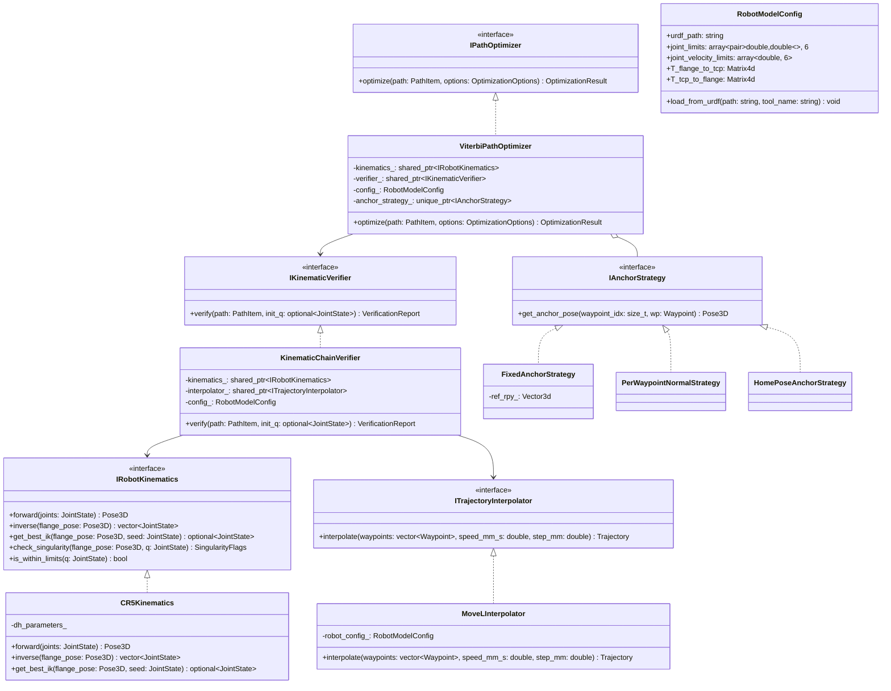

# Motion 模块 C++ 重构与面向对象架构设计方案

## 1. 概述与设计目标

### 1.1 背景与现状
当前机器人运动学验证（Verification）与航点位姿全局优化（Optimization）主要运行在 Python 运行时中（`path_verification_service.py`、`path_opt.py`、`kinematic_chain_verifier.py`），虽然核心逆解与部分密集抽检通过 C++ 动态库（`cr5_ur_kin` / `cr5_path_opt`）加速，但整体仍然存在以下痛点：
1. **进程隔离与通信开销大**：为防止崩溃影响 Web 主服务，Python 层采用了 `multiprocessing.Process` + `Pipe` 机制，进程冷启动、序列化及反序列化有 100~300ms 延迟。
2. **数据流动与坐标系耦合较深**：工具偏置（TCP Offset）、工件表面航点（Surface Waypoints）、枪尖航点（TCP Waypoints）在多处存在分散处理，缺乏统一强类型的领域对象封装。
3. **架构职责未解耦**：Viterbi 动态规划、MoveL 轨迹稠密插值、URDF 参数解析、奇异点与关节极限判定混合在一起，不利于扩展新机器人型号（如 Dobot Nova、UR 系列等）或新工艺算法。

### 1.2 重构目标
将运动学校验与航点优化功能彻底下沉至独立高性能 C++ 模块 `motion/` 中，采用**严格面向对象设计（OOP）**原则解耦，最终编译输出高性能命令行可执行文件 `motion_cli`：
- **纯粹高内聚的面向对象设计**：遵循 SOLID 原则，设计抽象接口层，分离几何建模、运动学解算、插值算法、图搜索优化与文件 IO。
- **极致性能（RK3588 ARM64 适配）**：利用 Eigen 矩阵运算与无锁数据结构，实现整条轨迹优化控制在 5~15ms 以内，验证耗时 < 2ms。
- **清晰标准的 CLI 交互协议**：通过标准输入输出及 YAML/JSON 接口与 Python Web 后端（FastAPI）无缝集成，提供机器可读的结构化 JSON 报告，彻底消除 Python 端子进程管理隐患。

---

## 2. 核心架构与面向对象模型设计

系统划分为清晰的五层架构：**领域模型层 (Model)**、**运动学抽象层 (Kinematics)**、**轨迹生成与校验层 (Trajectory & Verification)**、**全局姿态优化层 (Optimization)** 与 **应用/交互层 (Application & CLI)**。

### 2.1 整体架构图 (Architecture Overview)



---

## 3. 详细设计：设计模式与 SOLID 原则实践

### 3.1 单一职责原则 (SRP) 与领域实体分离
- **`Pose3D` / `Transform4d`**: 仅表示三维空间变换（四元数旋转 + 平移向量），支持与 Euler (XYZ, deg/rad) 和 4x4 齐次矩阵安全互转。
- **`Waypoint`**: 航点聚合根，清晰包含：
  - `surface_point_base_mm`: 工件表面物理点；
  - `surface_normal_base`: 表面法向量；
  - `tcp_pose_base`: 机械臂工具中心点位姿；
  - `spraying`: 喷涂状态（`ON` / `OFF`）；
  - `is_jump`: 是否为列间转移跳跃段；
  - `standoff_distance_mm`: 喷涂工艺距离。
- **`RobotModelConfig`**: 仅负责管理机器人 URDF 模型、关节限位、关节最大转速及末端工具矩阵（$T_{\text{flange}\to\text{tcp}}$ 及 $T_{\text{tcp}\to\text{flange}}$），不参与业务求解。

### 3.2 依赖倒置原则 (DIP) 与策略模式 (Strategy Pattern)
1. **机器人求解器可插拔 (`IRobotKinematics`)**：
   - 抽象出标准六自由度正逆解接口，`ViterbiPathOptimizer` 与 `KinematicChainVerifier` 仅依赖 `IRobotKinematics` 纯虚接口。
   - 当前实现为 `CR5Kinematics`（基于经典解析几何六轴快速求解），未来接入六轴/协同臂或 UR 系列仅需增加实现类，无需改动优化管线代码。
2. **锚点参考姿态策略 (`IAnchorStrategy`)**：
   采用策略模式隔离三种锚点模式：
   - `FixedAnchorStrategy`：配置模式（从 config / live 传入统一基准姿态）；
   - `HomePoseAnchorStrategy`：机械臂 Home 姿态正解作为基准；
   - `PerWaypointNormalStrategy`：逐点名义表面法向自适应包络。

### 3.3 建造者模式 (Builder Pattern) 配置组装
针对复杂的校验与优化超参数（容差网格、Beam Width、MoveL 抽检步长、权重项等），采用 Builder 模式提供安全、自校验的配置构造：
```cpp
OptimizationOptions options = OptimizationOptionsBuilder()
    .set_tool_grid_x(-5.0, 5.0, 2.0)
    .set_tool_grid_y(-5.0, 5.0, 2.0)
    .set_tool_grid_z(-180.0, 180.0, 10.0)
    .set_anchor_tolerances(10.0, 10.0, 180.0)
    .set_beam_width(32)
    .set_max_candidates_per_branch(16)
    .set_dense_verify(true)
    .build();
```

---

## 4. 关键核心模块职责划分与类接口定义

### 4.1 几何与姿态基础类 (`motion/common/types.hpp`)
```cpp
namespace motion {

struct Pose3D {
    Eigen::Vector3d position_mm; // x, y, z in mm
    Eigen::Quaterniond orientation; // w, x, y, z

    static Pose3D from_euler_deg(double x, double y, double z, double rx, double ry, double rz);
    Eigen::Matrix4d to_transform_m() const;
    Eigen::Vector3d to_euler_deg() const;
};

struct Waypoint {
    int index;
    Eigen::Vector2i pixel;
    Eigen::Vector3d surface_point_base_mm;
    Eigen::Vector3d surface_normal_base;
    Pose3D tcp_pose_base;
    double standoff_distance_mm;
    bool spraying_on{true};
    bool is_jump{false};
    int leg_id{0};
};

using JointState = Eigen::Matrix<double, 6, 1>; // 弧度单位

} // namespace motion
```

### 4.2 轨迹插值器 (`motion/trajectory/movel_interpolator.hpp`)
- **功能**：将离散的 TCP Waypoint 序列转化为高频笛卡尔插值点（MoveL）。
- **坐标系剥离**：在插值时自动应用 $T_{\text{flange}} = T_{\text{gun}} \cdot T_{\text{tcp\_inv}}$，输出成对的 `(T_tcp, T_flange, dt, is_jump)` 密集序列。
- **跳跃段感知**：标记 `is_jump`，在离散段放宽笛卡尔直线约束，允许关节空间过渡。

### 4.3 运动学链校验器 (`motion/verification/kinematic_chain_verifier.hpp`)
- **连续逆解追踪**：以 `curr_q` 为种子通过 `solver->get_best_ik(T_flange, curr_q)` 解算最近无翻转姿态分支，自动对 J6 多圈绕组进行连续 Unwrap。
- **跳跃段解耦重选**：在列间转移段（`is_jump=true` 且 `curr_q` 无解）自动使用全局 `q_ref` 重新选支，并抑制连续性误报。
- **动力学评估**：根据步长与给定线速度计算关节角速度 $\dot{q} = \Delta q / \Delta t$，统计各轴峰值速度与推荐安全速度 `recommended_safe_speed_mm_s`。
- **结构化诊断**：生成完整的 `VerificationReport`，包括问题严重等级（`ERROR`/`WARNING`）、触发步骤索引、奇异点类型等。

### 4.4 全局 Viterbi 姿态优化器 (`motion/optimization/viterbi_optimizer.hpp`)
- **搜索状态空间生成**：
  在工具系下以 $(\text{tol}_x, \text{tol}_y, \text{tol}_z)$ 离散化网格采样，经锚点硬容差包络投影后生成物理候选姿态集。
- **8 大分支多样性分桶 (Diversity Bucketing)**：
  每个阶段对 8 组逆解分支独立维护容量为 $K$（如 16）的优先队列，彻底防止某一逆解分支霸占候选池导致局部解退化。
- **快速 MoveL 抽检与边评估**：
  复用并扩展当前高效的 C++ `walk_movel_controller`，对于转移跳跃段（`is_jump=true`）仅评估终点关节距离与奇异性，大幅加速 DP 计算。
- **回退与稠密验证**：
  若快速候选搜索失败，触发自适应全量候选回退；DP 选出最优路径后，立即调用 `IKinematicVerifier` 执行 1.5mm 密采样硬门校验。

---

## 5. CLI 命令接口设计与 Web 服务集成方案

### 5.1 CLI 命令集设计 (`motion_cli`)

二进制路径：`motion/bin/motion_cli`

#### 子命令 1: 路径运动学验证 (`verify`)
```bash
motion_cli verify \
  --input /path/to/scan.raw.path.yaml \
  --output /path/to/scan.raw.path.yaml \ # 可选: 原地或保存至新文件
  --urdf /path/to/cr5_robot_with_my_tools.urdf \
  --tool-tcp laser_nozzle \
  --speed 150.0 \
  --step 1.5 \
  --format json # 标准输出打印精简 JSON 汇总供 Python 读取
```

#### 子命令 2: 航点位姿全局优化 (`optimize`)
```bash
motion_cli optimize \
  --input /path/to/scan.raw.path.yaml \
  --output /path/to/scan.poi.path.yaml \
  --urdf /path/to/cr5_robot_with_my_tools.urdf \
  --tool-tcp laser_nozzle \
  --anchor-source home \ # config | home | raw
  --ref-rpy 0,0,0 \      # anchor-source 为 config 时生效
  --anchor-tol 10,10,180 \
  --grid-x -5,5,2 \
  --grid-y -5,5,2 \
  --grid-z -180,180,10 \
  --speed 150.0 \
  --step 1.5 \
  --format json
```

### 5.2 统一的 JSON 进程间通信协议 (IPC Protocol)

为消除 Python 解析复杂日志文本的脆弱性，`motion_cli` 在成功或失败时均向 `stdout` 输出单行严格规范的 JSON 数据：

```json
{
  "success": true,
  "action": "optimize",
  "elapsed_ms": 8.42,
  "was_modified": true,
  "status": "PASS",
  "summary": {
    "total_paths": 1,
    "total_waypoints": 64,
    "total_interpolated": 812,
    "pass_count": 1,
    "fail_count": 0,
    "issues_count": 0
  },
  "peak_joint_speeds_deg_s": [12.4, 8.6, 21.0, 15.3, 18.2, 35.1],
  "recommended_safe_speed_mm_s": 150.0,
  "output_file": "/path/to/scan.poi.path.yaml"
}
```

### 5.3 Python Web 服务适配器实现 (`motion_cli_client.py`)

在 `app/src/services/` 或 `path_verification_service.py` 中，封装轻量异步/同步调用适配器：

```python
import json
import subprocess
from typing import Dict, Any

class MotionCliClient:
    def __init__(self, cli_bin: str = "/home/zhanlu/robots/AiSprayer/motion/bin/motion_cli"):
        self.cli_bin = cli_bin

    def verify(self, path_file: str, urdf_path: str, tool_name: str, speed_mm_s: float = 150.0) -> Dict[str, Any]:
        cmd = [
            self.cli_bin, "verify",
            "--input", path_file,
            "--urdf", urdf_path,
            "--tool-tcp", tool_name,
            "--speed", str(speed_mm_s),
            "--format", "json"
        ]
        res = subprocess.run(cmd, capture_output=True, text=True, check=True)
        return json.loads(res.stdout.strip())

    def optimize(self, input_file: str, output_file: str, urdf_path: str, tool_name: str,
                 anchor_source: str = "home", ref_rpy: list = None, tol_rpy: list = None) -> Dict[str, Any]:
        cmd = [
            self.cli_bin, "optimize",
            "--input", input_file,
            "--output", output_file,
            "--urdf", urdf_path,
            "--tool-tcp", tool_name,
            "--anchor-source", anchor_source,
            "--format", "json"
        ]
        if ref_rpy:
            cmd.extend(["--ref-rpy", ",".join(map(str, ref_rpy))])
        if tol_rpy:
            cmd.extend(["--anchor-tol", ",".join(map(str, tol_rpy))])

        res = subprocess.run(cmd, capture_output=True, text=True, check=True)
        return json.loads(res.stdout.strip())
```
**优势**：
- 摒弃了 `multiprocessing` 守护进程管理和 `Pipe` 死锁风险；
- 每次调用由 OS 处理内存释放，完全杜绝内存泄漏对长期运行的 Web 服务的污染；
- 崩溃隔离：即使出现段错误，直接以非零 Exit Code 抛出 Python 异常，Web 服务安然无恙。

---

## 6. 代码目录结构规划

```
motion/
├── CMakeLists.txt                 # 主 CMake 构建配置 (C++17/20, Eigen3, yaml-cpp, CLI11)
├── docs/
│   └── motion_cpp_refactor_design.md # 本方案设计文档
├── include/
│   └── motion/
│       ├── common/
│       │   ├── types.hpp          # Waypoint, Pose3D, JointState, TrajectoryStep
│       │   ├── math_utils.hpp     # 四元数旋转、Slerp、Euler XYZ 转换
│       │   └── logger.hpp         # 终端输出与格式化日志
│       ├── robot/
│       │   ├── i_robot_kinematics.hpp # 运动学核心纯虚接口
│       │   ├── cr5_kinematics.hpp     # CR5 几何正逆解与奇异点判定
│       │   └── robot_model_config.hpp # URDF 解析与 TCP 偏置管理
│       ├── trajectory/
│       │   ├── i_interpolator.hpp     # 轨迹插值器接口
│       │   └── movel_interpolator.hpp # Cartesian 直线与四元数 Slerp 插值
│       ├── verification/
│       │   ├── i_verifier.hpp         # 校验器接口
│       │   ├── kinematic_chain_verifier.hpp # 链式关节角速度与奇异点校验器
│       │   └── verification_report.hpp# 结构化校验报告实体
│       ├── optimization/
│       │   ├── i_optimizer.hpp        # 路径优化器接口
│       │   ├── anchor_strategy.hpp    # 锚点姿态包络计算策略
│       │   └── viterbi_optimizer.hpp  # Viterbi DP 8大分支姿态优化核心
│       └── io/
│           ├── yaml_codec.hpp         # scan.*.path.yaml 读取与写入序列化器
│           └── cli_parser.hpp         # 命令行参数解析
├── src/
│   ├── common/
│   │   ├── math_utils.cpp
│   │   └── logger.cpp
│   ├── robot/
│   │   ├── cr5_kinematics.cpp
│   │   └── robot_model_config.cpp
│   ├── trajectory/
│   │   └── movel_interpolator.cpp
│   ├── verification/
│   │   └── kinematic_chain_verifier.cpp
│   ├── optimization/
│   │   ├── anchor_strategy.cpp
│   │   └── viterbi_optimizer.cpp
│   ├── io/
│   │   └── yaml_codec.cpp
│   └── main.cpp                       # CLI 主程序入口
└── tests/
    ├── test_kinematics.cpp            # 运动学正逆解单测
    ├── test_interpolator.cpp          # MoveL 插值单测
    ├── test_verifier.cpp              # 校验逻辑单测
    └── test_optimizer.cpp             # 全局 Viterbi 优化效果与性能基准单测
```

---

## 7. 实施路线图 (Implementation Roadmap)

| 阶段 | 核心任务 | 交付成果 |
| :--- | :--- | :--- |
| **阶段 1：基础模型与运动学** | 搭建 CMake 构建框架；实现 `types.hpp` 与 `CR5Kinematics` 接口封装；接入 URDF TCP 动态加载。 | 单元测试通过，实现微秒级正逆解。 |
| **阶段 2：插值与运动学校验** | 实现 `MoveLInterpolator` 和 `KinematicChainVerifier`；支持跳跃段识别与分支 Unwrap。 | `motion_cli verify` 可独立运行并准确比对现有 Python 报告。 |
| **阶段 3：Viterbi 优化器移植** | 实现候选姿态展开、8 分支分桶、MoveL 边快速抽检及 DP 回溯。 | `motion_cli optimize` 运算耗时由 ~200ms 压缩至 < 10ms。 |
| **阶段 4：YAML/JSON IO 与 CLI 封装** | 基于 `yaml-cpp` 实现统一 YAML 序列化；提供完整标准参数与 JSON 返回格式。 | 完整独立的 `motion_cli` 可执行二进制。 |
| **阶段 5：Python Web 服务对接** | 在 `path_verification_service.py` 中切换为 `MotionCliClient` 调用，彻底移除原 Python 多进程 Worker。 | 前端交互丝滑无卡顿，系统鲁棒性大幅提升。 |
