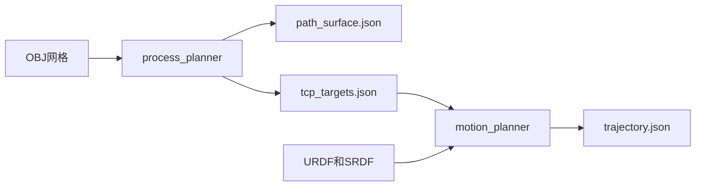

# Planner 重构设计

## 1. 目标与边界

将当前单文件 `src/main.cpp` 拆为两个独立程序：

- `process_planner`：工艺规划，输入 OBJ 网格，输出表面喷涂路径与 TCP 目标。
- `motion_planner`：运动规划，输入 TCP 目标和机器人模型，使用 KDL 与 TrajOpt 输出关节轨迹。

本次重构的约束：

1. 保持现有工艺路径生成、网格顺序、接缝去重、笔划边界和输出含义。
2. 运动规划以“每条纵向喷涂线”为并行粒度，线程数由 `--threads` 指定，默认 `6`。
3. 使用 Tesseract 内置的 `KDLInvKinChainNR_JL`，保持关节限位并避免 ROS 运行时依赖。
4. 并行不省略笔划间的自由空间过渡和碰撞检查。
5. 保留当前 `path_surface.json` 的扁平数组格式，避免已有可视化逻辑失效。

不在本次范围内：

- Python 侧缺失的 `AiSprayPlanner` 和 `plan.yaml` 编排链路。
- 修改控制器或机器人 SDK 的执行格式。
- 更改 Noether、Tesseract、TrajOpt 的第三方算法实现。

## 2. 现状与拆分依据

当前 `src/main.cpp` 有清晰的两阶段边界：

| 阶段 | 当前职责 | 主要依赖 |
| --- | --- | --- |
| 工艺规划 | OBJ 加载、网格清洗、法线补全、Noether 栅格路径、路径修饰、接缝去重、表面/TCP 位姿生成 | PCL、VTK、Noether |
| 运动规划 | URDF/SRDF 环境、IK、可达点过滤、TrajOpt、轨迹导出 | Tesseract、TrajOpt、yaml-cpp |

`--noether-only` 已在工艺阶段完成后退出，是拆分的天然边界。当前内存中的 TCP 目标不在 `path_surface.json` 中，因此两个程序之间必须新增显式的 TCP 中间文件。

## 3. 目标架构



### 3.1 可执行程序

#### `process_planner`

职责：

1. 按命令行中 `--mesh` 的原始顺序加载一个或多个 OBJ。
2. 清洗网格、三角化并补全顶点法线。
3. 使用 Noether 生成栅格路径。
4. 保持当前的短段过滤、均匀采样、栅格排序、蛇形排序、姿态平滑和直线笔划处理。
5. 保持跨 mesh 的 `covered_surface` 接缝去重状态与顺序。
6. 同时导出表面位姿和已完成 standoff/喷嘴朝向变换的 TCP 位姿。

不依赖 Tesseract、KDL 或 TrajOpt。

#### `motion_planner`

职责：

1. 读取 `tcp_targets.json`，验证 schema 与笔划边界。
2. 读取 URDF/SRDF 并建立 Tesseract 环境。
3. 配置并验证 Tesseract 内置的 KDL 运动学插件。
4. 以每条纵向喷涂线为单位，执行 IK 预处理和 TrajOpt 喷涂段规划。
5. 使用线程池并发执行独立纵线任务。
6. 按原始笔划顺序串行规划相邻纵线之间的 FREESPACE 安全过渡。
7. 合并所有结果，输出 `trajectory.json`。

## 4. 目录与文件拆分

实施后的建议目录：

```text
planner/
├── CMakeLists.txt
├── build_deps.sh
├── run_planner.sh
├── include/planner/
│   ├── types.hpp
│   ├── json_io.hpp
│   ├── thread_pool.hpp
│   ├── process_planner.hpp
│   └── motion_planner.hpp
└── src/
    ├── common/
    │   ├── json_io.cpp
    │   └── thread_pool.cpp
    ├── process/
    │   ├── mesh_preprocessor.cpp
    │   ├── raster_path_planner.cpp
    │   ├── path_modifiers.cpp
    │   ├── seam_deduplicator.cpp
    │   ├── tcp_target_exporter.cpp
    │   └── process_main.cpp
    └── motion/
        ├── motion_planner.cpp
        └── motion_main.cpp
```

职责边界：

| 模块 | 责任 |
| --- | --- |
| `types` | 不含第三方业务对象的 DTO，如 Pose、Stroke、TcpTarget、TrajectoryPoint。 |
| `json_io` | 中间文件 schema 校验、读写和旧 `path_surface.json` 兼容读写。 |
| `thread_pool` | 固定大小线程池、任务提交、异常回传、有序回收和取消。 |
| `mesh_preprocessor` | `cleanMesh`、`ensureVertexNormals`。 |
| `raster_path_planner` | Noether 栅格生成与方向生成器。 |
| `path_modifiers` | 排序、直线化、姿态锁定、NaN 清除。 |
| `seam_deduplicator` | 跨 mesh 覆盖区过滤；必须顺序执行。 |
| `tcp_target_exporter` | 表面位姿到 TCP 位姿的固定变换和中间文件输出。 |
| `motion_planner` | Tesseract 环境、KDL、碰撞管理器、IK 预解、并行笔划规划和轨迹导出。 |
| `stroke_motion_planner` | 一条纵线的 TrajOpt 线性喷涂规划。 |
| `transition_motion_planner` | 相邻纵线间的串行 FREESPACE 连接规划。 |

## 5. 进程间数据契约

### 5.1 `path_surface.json`

保持现有格式和文件名，供可视化继续使用：

```json
[
  {
    "x": 0.0,
    "y": 0.0,
    "z": 0.0,
    "qx": 0.0,
    "qy": 0.0,
    "qz": 0.0,
    "qw": 1.0,
    "segment_start": true
  }
]
```

该文件表达表面路径，不是运动规划进程的主输入。运动规划不得覆写它；IK 过滤后的可视化数据另写为 `path_surface_reachable.json`，防止工艺结果被隐式修改。

### 5.2 `tcp_targets.json`

由 `process_planner` 输出、`motion_planner` 读取。建议 schema：

```json
{
  "schema_version": 1,
  "process_parameters": {
    "standoff": 0.2,
    "row_spacing": 0.04,
    "point_spacing": 0.01
  },
  "strokes": [
    {
      "mesh_index": 0,
      "stroke_index": 0,
      "points": [
        {
          "x": 0.0,
          "y": 0.0,
          "z": 0.0,
          "qx": 0.0,
          "qy": 0.0,
          "qz": 0.0,
          "qw": 1.0
        }
      ]
    }
  ]
}
```

约束：

- `strokes` 顺序必须等同当前工艺路径中 `segment_start` 的顺序。
- 每个 `points` 数组至少包含两个点。
- 位姿已完成现有的 standoff 平移和绕 TCP X 轴旋转 π 的喷嘴变换。
- `mesh_index` 和 `stroke_index` 只用于可追溯性，不参与排序。
- `motion_planner` 必须拒绝未知主版本 schema、空 stroke、非有限数和非单位四元数。

### 5.3 `trajectory.json`

继续使用现有文件名。最终统一每个点至少包含：

- `joint_positions`
- `time_from_start`
- `segment_start`
- `motion_type`：`FREESPACE` 或 `LINEAR`

`--angle-unit` 控制关节角输出单位；默认与当前行为一致。对于历史消费者，只要求 `joint_positions` 时保持可读。

## 6. 命令行接口

### 6.1 工艺规划

```text
process_planner
  --mesh <obj[,obj...]>
  --outdir <directory>
  --distance <meters>
  --row-spacing <meters>
  --point-spacing <meters>
  --straight-lines
  --direction <x,y,z>
  --image-horizontal <x,y,z>
  --seam-dedup-distance <meters>
```

工艺规划不再要求 `--urdf`、`--srdf`、`--group` 或 `--tcp`。

### 6.2 运动规划

```text
motion_planner
  --input <tcp_targets.json>
  --urdf <file>
  --srdf <file>
  --outdir <directory>
  --group <name>
  --tcp <frame>
  --position-tolerance <meters>
  --angle-unit <deg|rad>
  --threads <positive-integer>
```

`--threads` 默认 `6`。零、负数、非整数或超过实现定义上限的值必须报错；不使用“自动取 CPU 核数”的隐式语义。

### 6.3 兼容编排

`run_planner.sh` 在过渡期保留现有参数习惯，并串行调用：

```text
process_planner -> motion_planner
```

旧 `--noether-only` 映射为仅执行 `process_planner`。旧 `--kdl-only` 映射为 `motion_planner --ik-only`，使用 KDL 写出可达的关节种子。

## 7. KDL 设计

### 7.1 依赖策略

KDL 已随当前 Tesseract 依赖安装，不引入 ROS 或额外插件依赖：

1. 使用 `KDLInvKinChainNR_JL` 与 `KDLInvKinChainNR_JLFactory`。
2. 使用 `base_link`、`tcp`、位置误差和迭代次数配置 KDL 链。
3. 运行时验证机械臂组、关节名、关节限位与 TCP 链一致性。

每个线程持有独立 Tesseract 环境和 KDL 运动学组。IK 预解按固定种子顺序执行，保持解选择稳定。

## 8. 多线程运动规划

### 8.1 并行与顺序边界

每条纵向喷涂线对应一个 stroke：


并行任务只规划一条纵线内部的 LINEAR 喷涂段。任务间不共享以下对象：

- `TrajOptMotionPlanner`
- `PlannerRequest`
- `CompositeInstruction`
- `ProfileDictionary`
- Tesseract `Environment`
- KDL 运动学组
- JSON 输出数组

任务结果只写入自身的局部缓冲，并返回原始 `stroke_index`。主线程按照 `stroke_index` 归并，不按任务完成先后归并。

### 8.2 IK 预处理

每条 stroke 内的 IK 解依赖前一个路点的种子，因此 stroke 内保持顺序。不同 stroke 可独立预解，但为保证稳定性，首版将按原始 stroke 顺序生成其初始种子和可达点集合。

遇到不可达点时：

- 当前 stroke 在不可达点处断开。
- 后续可达点重新标记为新的子 stroke。
- 工艺文件不变，仅在 `path_surface_reachable.json` 和运动输出中反映断点。

### 8.3 喷涂段并行

线程池提交一个任务对应一条经 IK 过滤后的纵线：

1. 构造该纵线自己的线性 Cartesian 指令。
2. 使用独立环境、独立 KDL 组和独立 TrajOpt 规划器求解。
3. 只导出该线的喷涂段，不导出到下一条线的自由空间移动。
4. 返回成功结果或包含 stroke 索引的错误。

任一任务失败时：

1. 停止提交未开始任务。
2. 等待正在运行的任务安全退出。
3. 不写最终 `trajectory.json`。
4. 输出失败 stroke、输入范围和 TrajOpt 错误信息。

### 8.4 笔划间安全过渡

原实现以当前笔划的优化末关节状态作为下一笔划 FREESPACE 起点，存在严格顺序依赖。为同时满足纵线并行和安全连续性：

1. 并行阶段只输出每条纵线内部的喷涂轨迹。
2. 主线程按工艺顺序读取相邻纵线的末端/起始关节状态。
3. 对每个相邻笔划对单独执行 TrajOpt FREESPACE 规划，并保留碰撞检查。
4. 按“过渡段 → 喷涂段 → 过渡段 → 喷涂段”顺序合并结果，并移除相邻重复关节点。

因此，线程数变化不改变喷涂笔划的顺序、笔划内线性约束或笔划间的安全规划语义。由于独立喷涂任务的初始优化上下文与旧单体不同，允许关节浮点值存在优化器容差内差异。

## 9. 线程池要求

线程池采用 C++17 标准库实现，不引入额外线程库。

最小能力：

- 固定大小工作线程集合。
- 提交返回 `future` 的任务。
- 首个异常回传到主线程。
- 停止接收新任务并有序关闭。
- 按 stroke 索引收集结果。
- 日志输出使用互斥或主线程汇总，禁止交错写入。

`--threads 1` 仍使用同一任务划分与结果归并代码，是可重复的单线程基线。

## 10. 构建设计

### 10.1 CMake targets

| Target | 源码 | 链接依赖 |
| --- | --- | --- |
| `planner_common` | DTO、JSON、线程池 | nlohmann_json、Threads |
| `planner_process` | 网格与 Noether 工艺库 | planner_common、PCL、VTK、Noether |
| `planner_motion` | KDL、TrajOpt 运动库 | planner_common、Tesseract、yaml-cpp、TrajOpt、OSQP、qpOASES |
| `process_planner` | 工艺 CLI | planner_process |
| `motion_planner` | 运动 CLI | planner_motion |

两个可执行程序必须分别链接自身所需依赖；`process_planner` 不链接 Tesseract/TrajOpt，`motion_planner` 不链接 PCL/Noether。

### 10.2 运行时库

两个程序继续使用 `deps/install/lib` 的 RPATH。`run_planner.sh` 继续设置 `LD_LIBRARY_PATH` 作为开发环境兼容手段，但二进制不依赖该环境变量才能在已配置 RPATH 的环境运行。

## 11. 迁移顺序

1. 新增 DTO、JSON IO 和 `tcp_targets.json`，以现有单体输出建立 JSON 基线。
2. 抽取工艺模块，生成 `process_planner`，校验其 `path_surface.json` 与当前 `--noether-only` 等价。
3. 抽取 Tesseract 环境和 TrajOpt 模块，接入 KDL 并完成单线程运动规划。
4. 先实现笔划内任务和有序归并，再实现笔划间串行安全过渡。
5. 接入线程池和 `--threads`，以 `--threads 1` 作为基线验证。
6. 更新 CMake 和 `run_planner.sh`，在过渡期保留旧参数的串联调用。
7. 在新旧输出和端到端验证通过后，移除单体 `main.cpp` 的重复实现。

## 12. 验收标准

### 12.1 工艺规划

- 单 mesh 和多 mesh 输入均可生成 `path_surface.json` 与 `tcp_targets.json`。
- 多 mesh 的接缝去重在输入顺序不变时结果不变。
- `segment_start` 与 stroke 分组一一对应。
- `--straight-lines`、自定义方向、图像左右排序和默认参数行为不退化。

### 12.2 KDL

- 构建期验证 Tesseract 的 KDL 运动学组件可用。
- 运行期 KDL 插件无法加载、组名/TCP 不匹配或 IK 无解时返回明确错误。
- 对典型和边界 TCP 位姿校验关节限位、FK 位姿误差与解的稳定性。

### 12.3 多线程轨迹规划

- `--threads 1`、`2`、`6` 和更高线程数都保持相同的 stroke 顺序和 JSON schema。
- 每条喷涂线在输出中保持 LINEAR 约束。
- 每对相邻纵线均存在经过碰撞检查的 FREESPACE 过渡。
- 任一并行任务失败不产生部分 `trajectory.json`。
- 压力运行不出现数据竞争、交错 JSON 写入或第三方对象跨线程共享。

### 12.4 输出兼容

- `path_surface.json` 仍可被现有可视化读取。
- `trajectory.json` 始终包含 `joint_positions`。
- `--angle-unit deg|rad` 的行为与当前约定一致。

