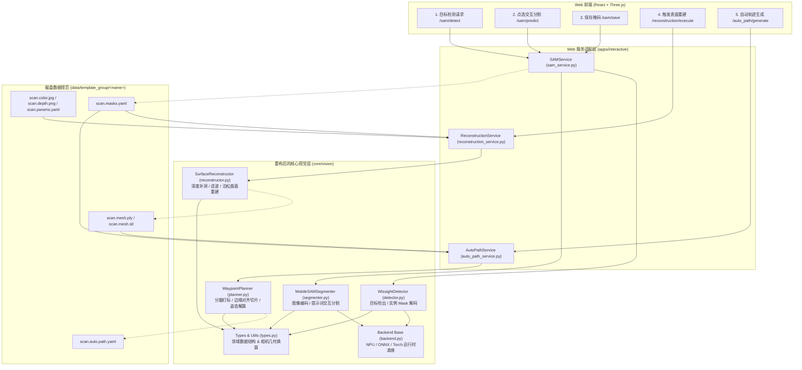

# core.vision 模块现代化重构设计方案

> **状态**：方案待评审（未修改任何生产代码）  
> **文档路径**：`app/src/core/vision/docs/vision_refactoring_design.md`  
> **目标**：彻底剥离早期 PC 离线脚本遗产，以 Web 端（Interactive Pipeline）调用为唯一核心，扁平化目录架构，面向对象封装，消除死代码与逻辑重复，修复算法隐患，建立完备的自动化测试体系。

---

## 1. 重构背景与核心目标

### 1.1 背景现状
当前 `app/src/core/vision` 模块经历了多阶段迭代演进，积累了大量历史技术债务：
1. **多代架构混杂**：并存着第一代离线点云录制/BPA重建（`vision_processor.py`、`visualize.py`、`recorder.py`）、第二代分腿拼接重建、第三代全景泊松重建及当前 Web 交互式服务（`sam_service` / `reconstruction_service` / `auto_path_service`）。
2. **结构嵌套与碎片化**：存在 `image2d/` 二级目录，部分核心算法（如 `split_jeans_mask`）被扔在 2D 目录却只被 3D 规划器调用；多个测试脚本直接混杂在源码目录中（部分甚至依赖本地弹窗 `cv2.imshow` 和 `draw_geometries`）。
3. **职责割裂与重复实现**：Web 服务的 `reconstruction_service.py` 越过 `PoissonReconstructor` 的封装，私自调用私有方法（`_erode_mask`、`_flying_pixel_mask`），并在外部重复实现了深度图 Navier-Stokes 补洞与点云生成。
4. **死代码堆积**：超过 3,000 行代码属于完全未被任何生产链路调用的陈旧工具或早期原型。

### 1.2 核心目标
1. **Web 中心化**：不考虑旧版离线终端脚本兼容性，完全围绕 Web 交互应用（`apps/interactive`）的 3 个阶段进行输入输出设计。
2. **扁平化结构**：取消 `image2d/` 等深层子目录，统一收敛至 `core/vision/` 单层扁平结构。
3. **面向对象与高内聚低耦合**：以类组织业务逻辑，将深度预处理、重建、规划等逻辑完整收敛到核心类中，对外暴露简洁语义接口。
4. **清除死代码与重复代码**：移除已淘汰的旧模块与孤立类，精简代码体量 60% 以上。
5. **修复已知 Bug 与隐患**：彻底修复 TCP 姿态计算奇异性、分腿连通域硬裁剪导致断腿、深度修复越界等问题。
6. **独立测试目录**：新建 `core/vision/tests/` 目录，统一使用标准 `unittest` 编写无硬件依赖的高覆盖率自动化测试。

> **范围边界**：本次重构仅限 `core/vision` 及三个 Web 服务适配层（`sam_service` / `reconstruction_service` / `auto_path_service`），**不含 `core/visioncpp`**（及其 `python/compare_with_python.py` C++ 并行验证开发工具），详见 §7.4。

---

## 2. 现存代码资产诊断与取舍清单

经过对全局代码库的静态引用分析（Grep & AST Trace），各文件调用关系与处理决策如下：

| 文件路径 | 现存代码量 | 当前角色 / 调用方 | 处理决策 | 决策依据 |
|---|---|---|---|---|
| `backend.py` | 154 行 | NPU (RK3588) / ONNX / Torch 统一推理底座 | **保留并优化** | 核心基础设施，`detector` 与 `segmenter` 均强依赖其后端自适应逻辑。 |
| `image2d/mobilesam_session.py` | 597 行 | MobileSAM 会话封装，`sam_service.py` 调用 | **扁平化重构** -> `segmenter.py` | 移至根目录，统一重构为面向对象的 `MobileSAMSegmenter` 类。 |
| `image2d/wissight_detector.py` | 394 行 | YOLOv8-seg 服装检出与实例 mask，`sam_service.py` 调用 | **扁平化重构** -> `detector.py` | 移至根目录，保持高效 NPU/ONNX 静态图解码，规范化命名。 |
| `reconstruction.py` | 487 行 | 泊松表面重建，`reconstruction_service.py` 调用 | **彻底重构** -> `reconstructor.py` | 剔除约 170 行 CLI/GUI（`__main__` 段）及旧包装，收敛预处理与重建算法，对外提供单入口方法。**额外删除 3 个仅服务旧离线 CLI、生产链路零调用的公开符号**：`calculate_cut_direction`、`poisson_reconstruct_for_surface_walk`、`overlay_mask_on_image`（仅被已死的 `from_file` 离线路径与 `vision_processor.py` 引用，不进入新 API）；其中 `k_matrix_to_intrinsics`/`depth_to_point_cloud` 迁入 `types.py`（见 §5.1）。 |
| `jeans_auto_waypoints.py` | 505 行 | 3D 轨迹规划与 TCP 姿态，`auto_path_service.py` 调用 | **重构整合** -> `planner.py` | 融合分腿与平滑逻辑，修复姿态奇异 Bug，对外提供 `WaypointPlanner`。 |
| `normal_smoother.py` | 60 行 | 1D 法向量滑动平均平滑器 | **合并入** `planner.py` | 功能极简且仅供规划器内部使用，合入 `planner.py` 内部减少琐碎文件。 |
| `image2d/jeans_segmentation.py` | 107 行 | 2D 掩码凸缺陷切裆算法 | **合并入** `planner.py` | 仅供 3D 航点规划前打标使用，合入 `planner.py` 内部消除跨目录混乱。 |
| `vision_processor.py` | 718 行 | 旧版 BPA (滚球法) 网格重建与旧离线流水线 | **彻底删除 (Dead Code)** | 全局无生产调用，已被泊松重建彻底取代。 |
| `visualize.py` | 898 行 | 旧版本地桌面 Open3D/PyBullet 3D 渲染器 | **彻底删除 (Dead Code)** | 全局无生产调用，Web 端已使用 Three.js 前端渲染。依赖已废弃的 camera factory。 |
| `recorder.py` | 92 行 | 离线扫描数据落盘工具 | **彻底删除 (Dead Code)** | 仅 `visualize.py` 引用，Web 采集已由 `camera_service` 完成。 |
| `point_cloud_processor.py` | 75 行 | 旧版点云转换与 KDTree 检索 | **彻底删除 (Dead Code)** | 仅 `recorder.py` 引用，功能在 `reconstruction.py` 重复实现。 |
| `surface_sampler.py` | 122 行 | 早期 3D 基础之字形采样原型 | **彻底删除 (Dead Code)** | 已被 `jeans_auto_waypoints.py` 完整吸收，仅旧测试脚本使用。 |
| `conformal_sampler.py` | 191 行 | 早期外侧缝拟合切片原型 | **彻底删除 (Dead Code)** | 已被 `jeans_auto_waypoints.py` 完整吸收，仅旧测试脚本使用。 |
| `image2d/segmenter.py` | 241 行 | 旧版 `SegmenterFactory` (YOLO / SAM3) | **彻底删除 (Dead Code)** | Web 生产环境走轻量化 MobileSAM 与 Wissight，此工厂类无任何业务调用。 |
| `image2d/zigzag_sampler.py` | 113 行 | 早期 2D 像素之字形采点原型 | **彻底删除 (Dead Code)** | 喷涂需要在 3D 空间按毫米等距，此 2D 像素采点为废弃方案。 |
| `test_surface_zigzag.py` | 237 行 | 依赖 GUI 窗口的离线测试 | **彻底删除** | 无效桌面 GUI 脚本，不属于自动化测试。 |
| `image2d/test_zigzag.py` | 100 行 | 依赖 `cv2.imshow` 的离线测试 | **彻底删除** | 无效桌面 GUI 脚本。 |
| `image2d/test_mobilesam.py` | 308 行 | 依赖本地鼠标点选的离线测试 | **彻底删除** | 交互测试已由前端 Web 页面承担。 |
| `test_jeans_auto_waypoints.py` | 108 行 | 航点规划 unittest | **迁移至** `tests/test_planner.py` | 有效单测，迁移并扩展断言。 |
| `image2d/test_sam_decoder_slice.py` | 208 行 | ONNX Decoder 切片回归测试 | **迁移至** `tests/test_segmenter.py` | 关键单测，迁移至新测试目录。 |
| `image2d/test_wissight_postprocess.py` | 228 行 | 目标检测与 mask 解码回归测试 | **迁移至** `tests/test_detector.py` | 关键单测，迁移至新测试目录。 |

**精简成果统计**：
- 待删除代码量：约 **3,100 行** 冗余与废弃代码（各文件行数累加约 3,095 行：vision_processor 718 + visualize 898 + recorder 92 + point_cloud_processor 75 + surface_sampler 122 + conformal_sampler 191 + segmenter 241 + zigzag_sampler 113 + 3 个 GUI 测试脚本 645）。
- 保留并重构的核心代码量：约 **1,500 行** 高质量生产代码。
- 代码精简比例达到 **67%**，显著降低系统认知负荷与维护成本。

**补充备注**：`image2d/` 目录当前**无 `__init__.py`**（依赖隐式命名空间包）；扁平化后统一由 `core/vision/__init__.py` 收口，并彻底删除 `image2d/` 目录，不残留空目录。

---

## 3. Web 业务全景与数据流架构

重构后的视觉模块紧密服务于 Web 系统的三大核心交互阶段，各阶段边界分明：



---

## 4. 扁平化架构与模块职责设计

### 4.1 目录结构对比

#### 重构前（目录深层、混杂严重）：
```text
app/src/core/vision/
├── __init__.py
├── backend.py
├── conformal_sampler.py           (废弃原型)
├── docs/
│   └── wissight_box_prompt_design.md
├── image2d/                       (不必要的深层嵌套)
│   ├── __init__.py
│   ├── jeans_segmentation.py     (仅 3D 用)
│   ├── mobilesam_session.py
│   ├── segmenter.py              (废弃工厂)
│   ├── test_mobilesam.py         (GUI 脚本)
│   ├── test_sam_decoder_slice.py
│   ├── test_wissight_postprocess.py
│   ├── test_zigzag.py            (GUI 脚本)
│   ├── wissight_detector.py
│   └── zigzag_sampler.py         (废弃原型)
├── jeans_auto_waypoints.py
├── normal_smoother.py
├── point_cloud_processor.py      (废弃脚本)
├── reconstruction.py
├── recorder.py                   (废弃脚本)
├── surface_sampler.py            (废弃原型)
├── test_jeans_auto_waypoints.py
├── test_surface_zigzag.py        (GUI 脚本)
├── vision_processor.py           (废弃 BPA)
└── visualize.py                  (废弃渲染器)
```

#### 重构后（完全扁平、职责清晰、单测独立）：
```text
app/src/core/vision/
├── __init__.py                   # 统一对外暴露顶级类与辅助函数
├── backend.py                    # 推理后端与硬件探测 (RK3588 NPU / ONNX / Torch)
├── types.py                      # 领域数据模型 (Detection) 与相机通用几何变换
├── detector.py                   # WissightDetector: 服装目标检测与实例 Mask 解码
├── segmenter.py                  # MobileSAMSegmenter: MobileSAM 图像编码与交互式掩码预测
├── reconstructor.py              # SurfaceReconstructor: 深度图预处理与 3D 泊松表面重建
├── planner.py                    # WaypointPlanner: 裤腿分割打标、等距切片与机器人 TCP 轨迹生成
├── docs/                         # 技术方案与设计文档目录
│   ├── wissight_box_prompt_design.md
│   └── vision_refactoring_design.md
└── tests/                        # 统一独立的自动化单测目录 (无 GUI 依赖)
    ├── __init__.py
    ├── test_detector.py          # 检测器解码、NMS 与通道契约测试 (移植原 test_wissight_postprocess)
    ├── test_segmenter.py         # MobileSAM Decoder 切片与图签名测试 (移植原 test_sam_decoder_slice)
    ├── test_reconstructor.py     # 表面重建预处理、深度补洞与泊松网格单元测试 (新增)
    └── test_planner.py           # 3D 航点规划、分腿打标与奇异姿态规避测试 (移植并扩展)
```

---

## 5. 核心类接口规范与详细设计

### 5.1 `types.py` (领域模型与基础几何)
消除各文件重复定义的工具函数与字典结构，集中管理强类型对象。以下三个符号从现有分散定义收敛到唯一归属（`vision_processor.py` 内那份同名重复实现随死代码删除）：
- `Detection`：现定义于 `wissight_detector.py:64`，被 `detector` 与前端回传体共用 → 迁入 `types.py`，`detector.py` 引用。
- `k_matrix_to_intrinsics`：现 `reconstruction.py:20`，被 `reconstruction_service.py` 与 `reconstructor` 共用 → 迁入 `types.py`。
- `depth_to_point_cloud`：现 `reconstruction.py:37`，`reconstructor` 内部主用；作为公共几何工具放 `types.py`，`reconstructor.py` 引用（保持对外可复用）。

```python
@dataclass
class Detection:
    box: Tuple[float, float, float, float]  # 原图绝对像素坐标 (x1, y1, x2, y2)
    cls_id: int
    cls_name: str
    score: float
    mask: Optional[np.ndarray] = None       # 原图尺寸 uint8 二值 mask (0/255)

    @property
    def area(self) -> float: ...
    @property
    def center(self) -> Tuple[int, int]: ...
    def to_dict(self) -> dict: ...

def k_matrix_to_intrinsics(k: np.ndarray) -> Tuple[float, float, float, float]:
    """把 3x3 内参矩阵 K 转换为 (fx, fy, cx, cy)。"""

def depth_to_point_cloud(depth: np.ndarray, intrinsics: Tuple[float, float, float, float]) -> np.ndarray:
    """将深度图转换为对齐的点云网格 [H, W, 3] (单位: mm)。"""
```

---

### 5.2 `detector.py` (`WissightDetector`)
负责全自动服装目标检测与可选的实例掩码解码。
```python
class WissightDetector:
    """Wissight 目标检测器：支持 RKNN (NPU) / ONNX / PyTorch 多后端。"""

    def __init__(
        self,
        backend: Optional[str] = None,
        classes: Optional[Sequence[str]] = None,
        conf: Optional[float] = None,
        iou: Optional[float] = None,
        max_boxes: Optional[int] = None,
    ): ...

    @property
    def available(self) -> bool:
        """模型是否就绪可用。"""

    @property
    def backend_desc(self) -> str:
        """当前活跃后端的描述信息。"""

    def detect(self, image_bgr: np.ndarray, with_masks: bool = False) -> List[Detection]:
        """执行推理，返回按面积降序排列的检出目标列表。"""

def get_detector() -> Optional[WissightDetector]:
    """获取进程内单例检测器。配置关闭或模型缺失时返回 None。"""
```

---

### 5.3 `segmenter.py` (`MobileSAMSegmenter`)
收敛原 `MobileSAMSession` 和 `*MobileSAMPredictor`，提供面向对象的高内聚接口。
```python
class MobileSAMSegmenter:
    """MobileSAM 交互分割引擎：支持 NPU 编码器 + ONNX/PyTorch 解码器。"""

    def __init__(self, device: Optional[str] = None):
        """初始化底层 Predictor (RKNN / ONNX / PyTorch)。"""

    @property
    def available(self) -> bool: ...

    @property
    def backend_desc(self) -> str: ...

    @property
    def is_image_set(self) -> bool: ...

    def set_image(self, image_bgr: np.ndarray) -> None:
        """编码输入图像并缓存图像特征 (Embedding)。"""

    def reset_image(self) -> None:
        """重置当前缓存的图像与特征。"""

    def predict(
        self,
        points: Sequence[Tuple[int, int]],
        labels: Sequence[int],
        box: Optional[Sequence[float]] = None,
    ) -> Tuple[Optional[np.ndarray], float]:
        """
        根据提示点 (前景/背景) 和可选的目标框预测高质量布尔掩码与置信度。
        :return: (boolean_mask [H, W], iou_score)
        """
```

---

### 5.4 `reconstructor.py` (`SurfaceReconstructor`)
**彻底解决现存职责割裂问题**：将原本散落在 `reconstruction_service.py` 内部的深度图 Navier-Stokes 修复、梯度飞点剔除、掩码腐蚀、点云生成、泊松重建与基座坐标变换，统一整合进 `SurfaceReconstructor` 类中。

```python
class SurfaceReconstructor:
    """3D 表面重建引擎 (Poisson Reconstruction)。
    
    提供从 (深度图 + 2D掩码 + 相机内参 + 手眼标定) -> (完整平滑 3D Trimesh 网格) 的一站式高内聚处理。
    完全与外部分割器及文件读写解耦，纯内存数据计算。
    """

    def __init__(
        self,
        z_min: float = 100.0,
        z_max: float = 3000.0,
        mask_erode_px: int = 1,
        flying_pixel_max_grad: float = 50.0,
        poisson_depth: int = 8,
        density_threshold: float = 0.15,
        voxel_size: float = 0.003,
        normal_radius: float = 0.03,
        smooth_iterations: int = 20,
        n_threads: int = 4,
    ): ...

    def preprocess_depth(
        self,
        depth_image: np.ndarray,
        mask_2d: np.ndarray,
        inpaint_holes: bool = True,
    ) -> Tuple[np.ndarray, np.ndarray]:
        """
        深度图前处理：
        1. 掩码内无效深度破洞修复 (OpenCV Navier-Stokes Inpainting)；
        2. 掩码适度向内腐蚀，切除边缘飞点；
        3. 深度梯度突变毛刺过滤；
        :return: (processed_depth, combined_valid_mask)
        """

    def reconstruct(
        self,
        depth_image: np.ndarray,
        mask_2d: np.ndarray,
        intrinsics_k: np.ndarray,
        T_camera_to_base: Optional[np.ndarray] = None,
        inpaint_holes: bool = True,
    ) -> trimesh.Trimesh:
        """
        高内聚重建主入口：
        执行 深度预处理 -> 2.5D点云生成 -> Open3D泊松重建 -> 边界密度修剪 ->
        Taubin平滑 -> 基座坐标系对齐 -> 最大连通分量保留。
        """
```

#### 5.4.1 并发与隔离（关键正确性约束）
`SurfaceReconstructor` 严格定位为**纯内存、无副作用**的计算核心：入参为内存中的 `depth_image`/`mask_2d`/`intrinsics_k`/`T_camera_to_base`，出参为 `trimesh.Trimesh`；**不读写磁盘、不管子进程**。

实际重建仍运行在 `reconstruction_service.py` 的**常驻 spawn 子进程**（`ReconstructionWorkerManager`）内，这是为规避 open3d 0.19 (aarch64) 内置 `PoissonRecon` 等值面提取的多线程竞态：同一输入连跑面数拖音、偶发 `Failed to close loop` 并升级为段错误/挂死，会把整个后端进程（含相机/机械臂/SAM）一起带走。

因此以下职责**保留在服务层，不下沉到核心类**：
- worker 常驻池、pipe 协议、崩溃/挂死区分与自动重试（`RECON_MAX_ATTEMPTS`/超时）；
- `scan.depth.png`/`scan.masks.yaml`/`scan.params.yaml` 读取与 `scan.mesh.ply/stl` 落盘；
- 标定文件（`data/calib/*/calibration_result.yaml`）搜索与 SprayerConfig 回退。

重构仅将服务层越界调用的私有方法（`_erode_mask`/`_flying_pixel_mask`）及重复的 inpaint/点云生成代码，收敛为对 `SurfaceReconstructor.reconstruct(...)` 单入口的调用（在 worker 子进程内执行）。

---

### 5.5 `planner.py` (`WaypointPlanner`)
**全面整合与重构**：吸收 `split_jeans_mask` 与 `PathNormalSmoother`，统一封装为 `WaypointPlanner` 类，对外暴露标准规划方法，并修复 TCP 姿态奇异翻转隐患。

```python
class WaypointPlannerError(ValueError):
    """规划失败异常（缺标定、空输入、几何异常等）。"""

class WaypointPlanner:
    """3D 喷涂航点与 TCP 轨迹规划器。
    
    流程：
    1. 2D 掩码凸缺陷分析自动分腿 (split_jeans_mask)；
    2. 3D Mesh 顶点反投影至图像坐标系进行左右腿归属打标；
    3. 提取各裤腿的主延伸方向与直外侧缝 (Outer Seam Fitting)；
    4. 沿外侧缝等距直面切片，生成之字形 (Zigzag) 表面轨迹；
    5. 裆部重叠航点去重并标记转移空走点 (is_jump)；
    6. 1D 轨迹法向量滑动平均平滑 (Normal Smoothing)；
    7. 沿法向外延 standoff_distance 计算 TCP 空间坐标与无奇异连续姿态 (Euler xyz)。
    """

    def __init__(
        self,
        spray_dist_mm: float = 150.0,
        row_spacing_mm: float = 60.0,
        point_spacing_mm: float = 100.0,
        dedup_radius_mm: float = 30.0,
        normal_smooth_window: int = 5,
        mesh_unit: str = "m",
        align_outer_edge: bool = True,
        depth_threshold_ratio: float = 0.1,
    ): ...

    def plan(
        self,
        mesh: trimesh.Trimesh,
        masks: Union[dict, np.ndarray],
        camera_intrinsics: np.ndarray,
        T_camera_to_base: np.ndarray,
        image_size: Tuple[int, int] = (1280, 800),
    ) -> dict:
        """
        执行轨迹规划，返回与 scan.auto.path.yaml 同构的字典。
        """
```

---

## 6. 关键 Bug 诊断与修复方案

在深入审计源码过程中，发现了以下若干影响系统鲁棒性与运动控制平稳性的技术隐患，将在本次重构中一并彻底修复：

### 6.1 Bug 1：TCP 姿态在曲线转向与跳步时的奇异翻转
- **现状**：在原 `jeans_auto_waypoints.py` 第 443~462 行的姿态构建逻辑中：
  ```python
  z_tool = -n_base
  if prev_x_tool is None:
      x_ref = np.array([0.0, 0.0, 1.0])
      if abs(float(np.dot(z_tool, x_ref))) > 0.92:
          x_ref = np.array([1.0, 0.0, 0.0])
  else:
      x_ref = prev_x_tool  # <-- 隐患！
  y_tool = np.cross(z_tool, x_ref)
  ```
  当曲面法向在空间发生较大倾斜，使得当前的 `z_tool` 恰好与历史 `prev_x_tool` 接近平行时（点积接近 $\pm 1$），`cross(z_tool, x_ref)` 的模长接近 0，触发 `ylen < 1e-9` 兜底分支 `y_tool = [0, 1, 0]`，导致机械臂手腕姿态发生突兀的 90° 旋转突变，易引发机械臂逆解超速或急停保护。
- **修复方案**：引入带共线检测的连续标架跟踪法（Double-Vector Parallel Transport）：
  ```python
  if prev_x_tool is not None and abs(float(np.dot(z_tool, prev_x_tool))) < 0.90:
      x_ref = prev_x_tool
  else:
      # prev 为空或接近平行时，选取与 z_tool 夹角最大的全局轴作为参考
      x_ref = np.array([1.0, 0.0, 0.0]) if abs(z_tool[2]) > 0.707 else np.array([0.0, 0.0, 1.0])
  ```
  且当 `is_jump=True`（换行或换腿）时，主动复位连续标架，确保每条喷涂扫描线内部严格连续平滑。

### 6.2 Bug 2：分腿算法单连通域粗暴裁剪导致褶皱裤腿断裂
- **现状**：原 `jeans_segmentation.py` 中的 `keep_largest_cc` 函数（确切位置 `jeans_segmentation.py:95-100`）强制只保留单条腿上最大的连通分量：
  ```python
  largest_label = 1 + np.argmax(stats[1:, cv2.CC_STAT_AREA])
  return labels == largest_label
  ```
  实际场景中，牛仔裤因表面水洗猫须、立体褶皱或光照阴影，分割掩码偶尔会在裤管中段形成 1~2 像素狭窄断口。执行 `keep_largest_cc` 会导致整截小腿掩码被直接丢弃，造成“单腿只有半截”的严重缺陷。
- **修复方案**：由“只留最大单个连通块”改为“过滤微小噪点碎屑（Area Filtering）”，保留所有面积大于主体一定比例（如主连通块面积 5%）的显著区域，容忍天然褶皱与微小断线。

### 6.3 Bug 3：深度修复 (Inpainting) 数值溢出与 NaN 污染
- **现状**：`reconstruction_service.py` 将 uint16 深度图强转为 float32 后直接送入 `cv2.inpaint`。若相机原始深度图包含大量 0 边界（如超量程或遮挡），OpenCV Navier-Stokes 算法在极小曲率处偶发产生微小负数或极值，导致后续点云坐标生成异常突刺。
- **修复方案**：在 `SurfaceReconstructor.preprocess_depth` 中对修复后的深度矩阵进行二次范围钳制与有效性校验：
  ```python
  depth_image[holes_mask] = np.nan_to_num(filled_depth[holes_mask], nan=0.0)
  depth_image = np.clip(depth_image, 0.0, self.z_max)
  ```

---

## 7. Web 适配层对接修改方案

重构后，`apps/interactive` 下的服务层只需做极少量的 import 路径与调用精简，代码可读性将大幅提升：

### 7.1 `apps/interactive/sam_service.py`
```diff
- from core.vision.image2d.mobilesam_session import load_mobilesam, MobileSAMSession
- from core.vision.image2d.wissight_detector import get_detector
+ from core.vision import MobileSAMSegmenter, get_detector
```
- 直接使用 `MobileSAMSegmenter` 管理交互分割会话，消除原 `predictor` 与 `session` 两套对象的概念混淆。

### 7.2 `apps/interactive/reconstruction_service.py`
```diff
- from core.vision.reconstruction import PoissonReconstructor, k_matrix_to_intrinsics, depth_to_point_cloud
+ from core.vision import SurfaceReconstructor, k_matrix_to_intrinsics
```
- 删除 service 内部冗长的深度补洞、掩码腐蚀、梯度飞点计算代码（约 50 行），直接调用高内聚主入口：
```python
reconstructor = SurfaceReconstructor(
    z_min=100.0, z_max=3000.0, mask_erode_px=1,
    flying_pixel_max_grad=50.0, poisson_depth=8,
    density_threshold=0.15, smooth_iterations=20, n_threads=4,
)
mesh = reconstructor.reconstruct(
    depth_image=depth_image,
    mask_2d=unified_mask_2d,
    intrinsics_k=intrinsics_k,
    T_camera_to_base=T_camera_to_base,
    inpaint_holes=True,
)
```
- **保留常驻 worker 子进程隔离**：上述 `reconstruct(...)` 调用仍发生在 `ReconstructionWorkerManager` 的 `_reconstruct_surface_impl` 内（spawn 子进程），文件读写与标定加载不变，仅把越界私有方法调用换成单入口（见 §5.4.1）。

### 7.3 `apps/interactive/auto_path_service.py`
```diff
- from core.vision.jeans_auto_waypoints import JeansAutoWaypoints, JeansAutoWaypointsError
+ from core.vision import WaypointPlanner, WaypointPlannerError
```
- 调用形式无缝映射到 `WaypointPlanner.plan(...)`。

### 7.4 `core/visioncpp` 及其对比脚本（不在本次范围）
`core/visioncpp/python/compare_with_python.py` 是一个非 Web 的 C++ 并行验证开发工具，引用旧类名 `JeansAutoWaypoints`/`PoissonReconstructor`。按本次“以 Web 调用为中心”的决策，**不纳入重构范围**：
- 不为它维护 API 兼容，也不提供 import 适配。
- 旧符号（`JeansAutoWaypoints`/`PoissonReconstructor`）移除后，该脚本会失效（`ImportError`），其迁移由 `core/visioncpp` 目录自行处理。

---

## 8. 测试体系架构与用例设计 (`tests/`)

为确保在任何无 GPU / 无 NPU 的开发机或轻量容器中均能稳定秒级运行，测试全部基于 **Mock 模型与合成几何数据 (Synthetic Geometry)** 构建，杜绝任何外部权重与弹窗依赖。

```text
app/src/core/vision/tests/
├── __init__.py
├── test_detector.py       # Wissight 目标检测后处理单元测试
├── test_segmenter.py      # MobileSAM 解码与提示词处理单元测试
├── test_reconstructor.py  # 表面重建前处理与泊松网格单元测试
└── test_planner.py        # 3D 航点规划、分腿打标与 TCP 姿态单元测试
```

### 8.1 `test_detector.py`
- `test_class_filtering`: 验证类别白名单（如只保留 `trousers`）与未知类别校验。
- `test_letterbox_coordinate_transform`: 验证反向缩放与偏移顺序，确保 box 精准映射回原图坐标。
- `test_box_clipping`: 验证边界截断，严禁出现小于 0 或超出宽高的坐标。
- `test_output0_contract_check`: 验证当通道数与类别契约不符时安全降级，不发生静默错位。
- `test_instance_mask_decoding`: 验证 `coeffs @ protos` 矩阵乘法、按框裁剪与最近邻重采样。

### 8.2 `test_segmenter.py`
- `test_check_decoder_graph`: 验证对非法 ONNX 图签名（如缺少 `orig_im_size`）的主动拦截。
- `test_box_prompt_expansion`: 验证传入 box 时正确转换为角点与 labels `[2, 3]`。
- `test_multimask_output_selection`: 验证单点提示选最优，加入 box/背景点后固定选稳定单 mask。

### 8.3 `test_reconstructor.py`
- `test_depth_inpainting`: 验证深度图中人工制造的 0 值破洞被 Navier-Stokes 正确修补且无 NaN。
- `test_flying_pixel_filtering`: 验证深度断崖边缘的梯度飞点被正确剔除。
- `test_reconstruct_synthetic_cylinder`: 给定合成的半圆柱深度图与矩形掩码，验证重建网格顶点数 > 0、面数 > 0、法向朝向一致，并能成功转换到指定基座坐标系。

### 8.4 `test_planner.py`
- `test_crotch_split`: 给定“人字形”双腿 2D 掩码，验证能精准检测凸缺陷并拆分为左右两条腿。
- `test_crotch_split_keeps_frayed_leg`: 构造中段带 1~2px 断口褒皱的单腿掩码，验证修复后（面积过滤而非 keep_largest_cc）不会丢弃整截小腿（回归 §6.2）。
- `test_mesh_vertex_projection_and_labeling`: 验证 3D 盒子投影到相机坐标后能准确按 2D 腿区域打上 Left/Right 标签。
- `test_outer_edge_alignment`: 验证直外侧缝拟合主轴方向的准确性。
- `test_tcp_pose_continuity_and_no_singularity`: 构造法向量连续旋转的路径，验证生成的 TCP Euler 角度无 90°/180° 奇异跳变，标架严格正交（回归 §6.1）。

### 8.5 Bug 与回归用例绑定
为确保 §6 三条修复可被自动化验证，各 Bug 对应一条回归用例：

| Bug | 修复章节 | 回归用例 |
|---|---|---|
| TCP 姿态奇异翻转 | §6.1 | `test_planner.py::test_tcp_pose_continuity_and_no_singularity` |
| 分腿 keep_largest_cc 断腿 | §6.2 | `test_planner.py::test_crotch_split_keeps_frayed_leg` |
| 深度 inpaint 溢出/NaN | §6.3 | `test_reconstructor.py::test_depth_inpainting` |

---

## 9. 实施与落地路线图

按用户要求，**当前阶段仅输出设计方案，不修改任何业务代码**。在方案获得确认后，推荐按以下次序安全实施：

1. **Step 1（基础层）**：新建 `core/vision/types.py`，整理共用几何函数与类型定义；在 `tests/` 建立框架。
2. **Step 2（感知层）**：扁平化迁移并重构 `detector.py` 与 `segmenter.py`，落地 `test_detector.py` 与 `test_segmenter.py`。
3. **Step 3（重建层）**：编写 `reconstructor.py`，整合预处理与泊松算法，落地 `test_reconstructor.py`。
4. **Step 4（规划层）**：编写 `planner.py`，融合分腿与平滑逻辑并修复姿态 Bug，落地 `test_planner.py`。
5. **Step 5（统一暴露）**：完善 `core/vision/__init__.py`，适配 Web 服务层（`sam_service`, `reconstruction_service`, `auto_path_service`）的导入路径与精炼调用。
6. **Step 6（清理死代码）**：删除 `vision_processor.py`, `visualize.py`, `recorder.py`, `image2d/` 等历史遗留文件。
7. **Step 7（全面验证）**：运行 `python3 -m unittest discover -s app/src/core/vision/tests`，确保全套测试 100% 通过；并联动 Web 后端验证全流程接口畅通。
